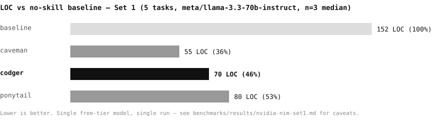
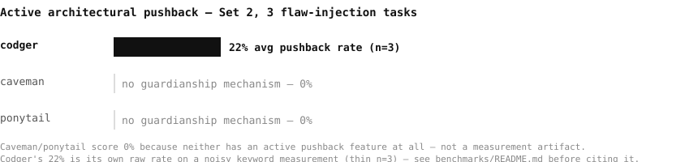
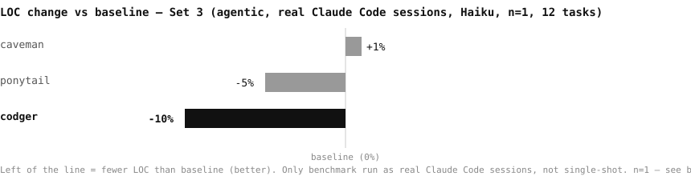

  

  
  
  

# Codger

An agent skill that tries to stop your AI from writing 400 lines when 4 would do. It also refuses to run `psql` just to remember a boolean.

Named after the grumpy old dev who's seen every one of these ideas before yours and is tired of explaining why the ladder still works: does this need to exist, is it already written somewhere, does the standard library do it, then and only then write code. Every "lazy senior dev" skill on GitHub lands on some version of this shape, ours included. We're not pretending otherwise.

## What it actually does

**Mode 1 — Essentialist Architect** (`mode-1-always-on.md`): always-on core philosophy. Terse output, minimum-viable code, and an auto-invoked pushback reflex when you ask it to add Redux to a static HTML page.

**Mode 2 — Micro-Router** (`mode-2-on-demand.md`): same philosophy, none of the token cost. The heavy skill instructions stay on disk until the situation actually calls for them.

Pick one. Mode 1 if you like being told no immediately. Mode 2 if you'd rather the agent shut up until it's earned the right to talk.

## Skills (`./skills/`)

| Skill | Does |
|---|---|
| `codger-core` | Terse comms, minimal-code bias. The baseline. |
| `codger-reality-check` | Refuses bad architecture out loud instead of quietly building it. |
| `codger-re` | Reverse-engineers obfuscated code in three disciplined passes instead of one confident guess. |
| `codger-chronodebug` | Debugs backward from the crash instead of forward from a hunch. |
| `codger-blast-radius` | Maps who breaks before touching the thing that breaks them. |
| `codger-ephemeral` | Any throwaway code ships with its own cleanup script. Debt with an expiry date. |

## Install

No manual copying of markdown into eleven different config folders.

- **Windows:** double-click `install.bat`
- **Mac/Linux:** `curl -fsSL https://raw.githubusercontent.com/Solen-AI-org/codger/main/install.sh | bash`
- **Anywhere (Node.js):** `node install.js`

The installer detects which of these are actually on your machine and drops itself into the correct, verified-real directory for each — not a guess, not a v1-era path that's been dead for six months:

| Tool | Where it lands |
|---|---|
| Claude Code (plugin) | `~/.claude/plugins/codger` — auto-inject via hooks, `/codger` commands |
| Google Antigravity | `~/.gemini/antigravity-cli/plugins/codger` |
| Hermes Agent | `~/.hermes/skills/codger` |
| Pi Agent | `~/.pi/agent/skills/codger` |
| OpenClaw | `~/.openclaw/skills/codger` |
| OpenJarvis | `~/.openjarvis/skills/codger` |
| Anything else on the `agentskills.io` standard | `~/.agents/skills/codger`, installed unconditionally |

It also checks your **current project root** for rule conventions and appends itself only if it finds one already there:

`.clinerules/`, `.cursorrules`, `.cursor/rules/`, `.windsurfrules`, `.windsurf/rules/`, `.roo/rules/`, `.roorules`, `AGENTS.md` — covering Cline, Cursor, Windsurf, Roo Code, and OpenCode.

### Commands

| Command | Does |
|---|---|
| `/codger [lite\|full\|ultra\|off]` | Set intensity or turn off. No arg = report current level. |
| `/codger-review` | Review current diff for over-engineering. |
| `/codger-audit` | Audit the whole repo for over-engineering. |
| `/codger-debt` | Harvest deferred shortcuts into a debt ledger. |
| `/codger-gain` | Show the measured impact scoreboard. |
| `/codger-stats` | Read your session log, count tokens saved. |
| `/codger-compress` | Rewrite memory files for smaller future sessions. |
| `/codger-help` | Quick reference for the commands above. |

## Benchmark & stats

`benchmarks/` — same harness shape as ponytail's own (promptfoo, vendored MIT metrics), plus a guardianship set ponytail's doesn't have. Four sets run so far (Set 0 tooling + Sets 1–3 below), different strengths — read all three charts, not just one.

### Set 1 — parity with ponytail's own benchmark (single-shot)

| arm | LOC | vs baseline |
|---|--:|--:|
| caveman | 55 | 36% |
| **codger** | **70** | **46%** |
| ponytail | 80 | 53% |

n=3, single free model (`meta/llama-3.3-70b-instruct` via NVIDIA NIM), single-shot (no real session, no re-injection cost) — direction matches ponytail's own published Claude numbers, exact ranking is this-model-this-run, not a general claim. Caveman comes out leanest here.

### Set 2 — guardianship (codger-only, no ponytail/caveman equivalent)

Codger is the only one of the three with an active architectural-pushback benchmark at all — `pushback.js`, three tasks with a real flaw baked in (removing rate limiting, adding Redux to a static page, replacing offline models with cloud calls). But read the raw numbers critically: **baseline scores highest (56%)**, not codger (22%) — the keyword heuristic favors baseline's verbose, hedged prose over codger's terse output, and n=3 is thin for a binary rate. Not evidence the guardianship skill doesn't work, but not a clean win either — see [benchmarks/README.md](benchmarks/README.md#set-2--guardianship-promptfooconfigpushbackyaml) before citing it.

### Set 3 — real Claude Code sessions (most credible: not single-shot)

| arm | LOC | tokens | cost | time | over-eng. (0–3) |
|---|--:|--:|--:|--:|--:|
| caveman | +1% | −1% | −1% | −13% | 0.50 |
| ponytail | −5% | +10% | +14% | +10% | 0.67 |
| **codger** | **−10%** | +12% | +7% | +19% | **0.58** |

Only set run as real Claude Code sessions (Haiku, n=1, 12 surgical tasks) instead of single-shot API calls — the other skills as installed hook-based plugins, codger via `--append-system-prompt`. Codger writes the least code of the three and is second-lowest on over-engineering, at a real tokens/cost/time premium (a CLAUDE.md-style ruleset re-injects heavier than a single skill file). n=1 — one run, not a settled result.

Full methodology and caveats for all sets: [benchmarks/README.md](benchmarks/README.md).

**No API keys required for the skill itself.** The skill works out of the box — it's just a ruleset + skill files.

**Benchmarks require an API key** (only if you want to run them):
- `benchmark-nvidia.py` — uses NVIDIA NIM (free tier, needs `NVIDIA_API_KEY` in `.env`)
- `promptfooconfig.yaml` — uses Anthropic API (needs `ANTHROPIC_API_KEY`)
- See `benchmarks/README.md` for details. No runs are committed — eval'ing sends real billed API calls.

`node stats.js` — real per-session token usage for your current Claude Code session (no savings claim until a benchmark result is committed; no fabricated numbers in the meantime).

## A note on honesty

Ladders like this one don't replace judgment, they just front-load it. If your agent starts refusing to write error handling because "the ladder said no," that's not the ladder's fault — trust boundaries, security, and data-loss handling are explicitly exempt in every version of this idea worth using, including this one.

## License

MIT. Copy it, rename it, feed it to your own agent. That's what we did.
