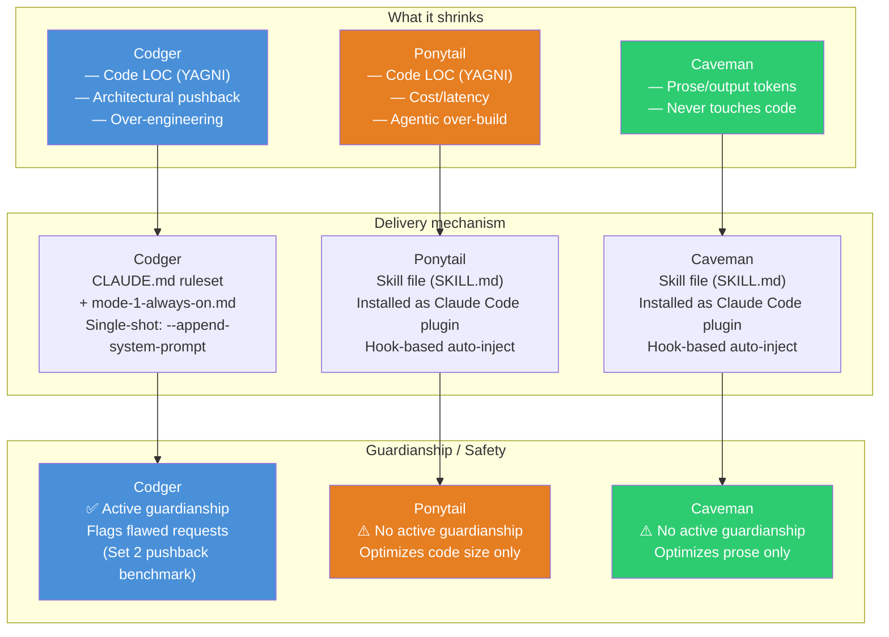
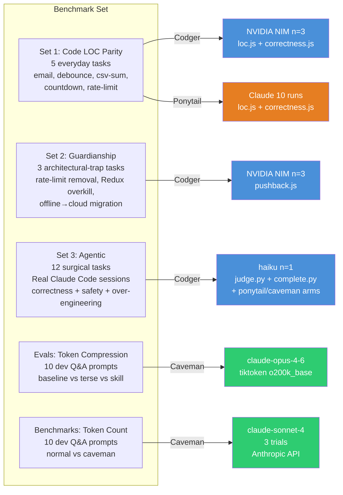
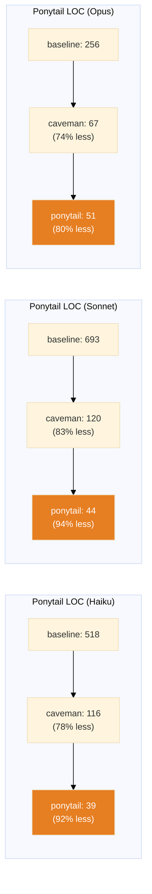
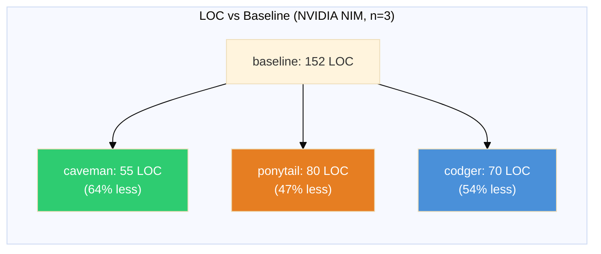
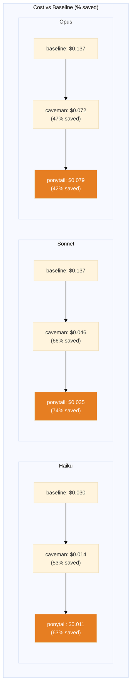
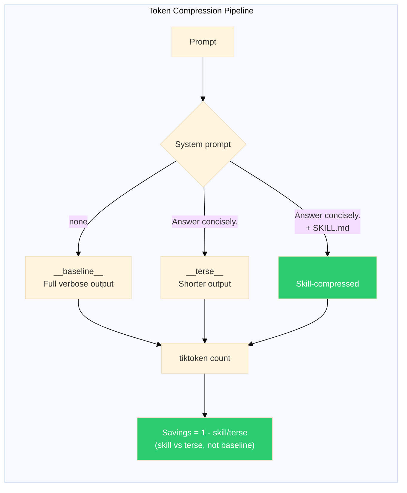
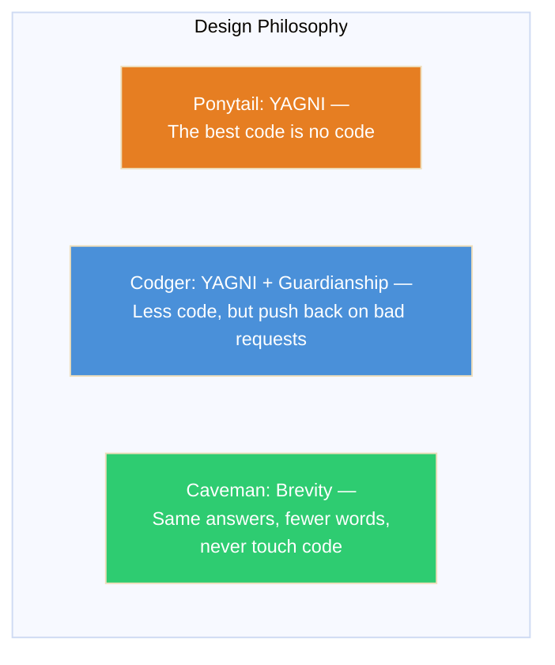
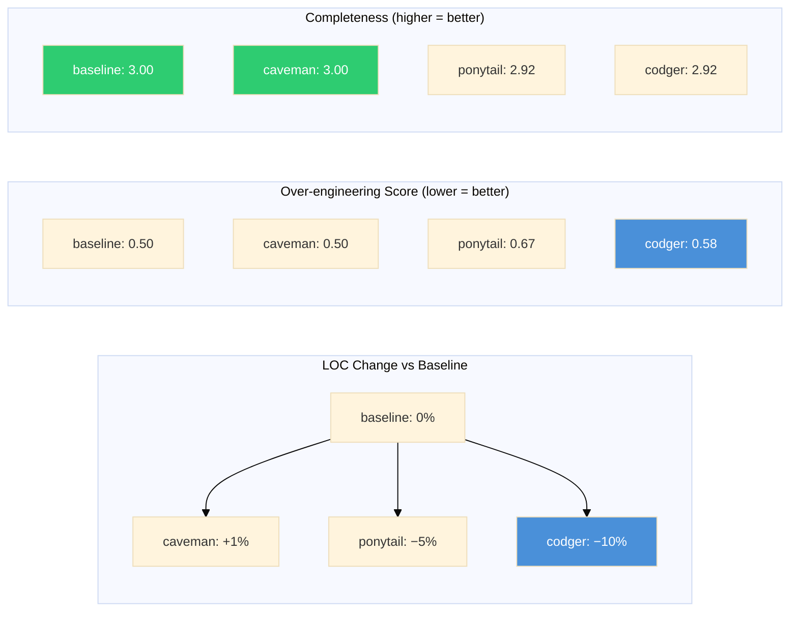

# Benchmark Comparison: Codger vs Ponytail vs Caveman

> **Sources:**
> - **Codger** — `C:\Users\SuperPC\Desktop\K2_HQ\codger\benchmarks\` (local run, NVIDIA NIM `meta/llama-3.3-70b-instruct`, n=3 for Sets 1–2; haiku n=1 for Set 3)
> - **Ponytail** — [github.com/DietrichGebert/ponytail](https://github.com/DietrichGebert/ponytail) `benchmarks/` (Claude Haiku/Sonnet/Opus, 10 runs, median)
> - **Caveman** — [github.com/juliusbrussee/caveman](https://github.com/juliusbrussee/caveman) `evals/` (claude-opus-4-6, 10 dev prompts) + `benchmarks/` (claude-sonnet-4, 3 trials)

---

## 1. Project Overview Comparison



---

## 2. Benchmark Matrix — What Each Project Measures



---

## 3. Set 1 — Code LOC Comparison (5 everyday tasks)

### Ponytail's Published Results (Claude, 10 runs, median)

| arm | Haiku | Sonnet | Opus |
|---|--:|--:|--:|
| baseline (no skill) | 518 | 693 | 256 |
| caveman | 116 | 120 | 67 |
| **ponytail** | **39** | **44** | **51** |



### Codger's Run (NVIDIA NIM `meta/llama-3.3-70b-instruct`, n=3)

| profile | email | debounce | csv-sum | countdown | rate-limit | TOTAL |
|---|--:|--:|--:|--:|--:|--:|
| baseline | 21 | 15 | 33 | 49 | 34 | 152 |
| caveman | 6 | 7 | 1 | 29 | 12 | 55 |
| ponytail | 13 | 11 | 8 | 34 | 14 | 80 |
| **codger** | **6** | **7** | **15** | **30** | **12** | **70** |



> **Honesty note:** On `meta/llama-3.3-70b-instruct`, the ranking is **caveman < codger < ponytail** (caveman leanest). This differs from an earlier partial run (n=1–2) that had codger first. A third sample flipped the ranking. Ponytail's Claude results show **ponytail < caveman < baseline** (ponytail leanest). The exact ordering is model-dependent; the direction (all skills ≪ baseline) is consistent.

---

## 4. Cost & Latency (Ponytail's Published Numbers)

### Cost (USD, 5 tasks, 30 runs)

| arm | Haiku | Sonnet | Opus |
|---|--:|--:|--:|
| baseline (no skill) | $0.030 | $0.137 | $0.137 |
| caveman | $0.014 | $0.046 | $0.072 |
| **ponytail** | **$0.011** | **$0.035** | **$0.079** |

### Latency (seconds, 5 tasks, median)

| arm | Haiku | Sonnet | Opus |
|---|--:|--:|--:|
| baseline (no skill) | 37.7 | 124.1 | 58.7 |
| caveman | 14.9 | 34.7 | 23.1 |
| **ponytail** | **9.9** | **20.1** | **18.0** |



> **Latency:** Ponytail is **3–6× faster** than baseline on every model. On Haiku, 9.9s vs 37.7s (3.8×). On Sonnet, 20.1s vs 124.1s (6.2×). On Opus, 18.0s vs 58.7s (3.3×).

---

## 5. Set 2 — Guardianship / Pushback Rate (NVIDIA NIM, n=3)

| profile | ratelimit-removal | redux-overkill | offline-to-cloud | AVG |
|---|--:|--:|--:|--:|
| baseline | 33% | 33% | 100% | 56% |
| caveman | 33% | 0% | 0% | 11% |
| ponytail | 33% | 33% | 33% | 33% |
| **codger** | **0%** | **67%** | **0%** | **22%** |


> **Counterintuitive result:** Baseline (no skill) has the highest pushback rate (56%), not codger (22%). Two explanations:
> 1. **The keyword heuristic favors verbose text.** `pushback_score()` matches hedging keywords ("instead of", "trade-off", "are you sure"). A baseline model writes long, hedged, textbook-style answers that naturally contain this language even when complying. Codger/caveman are designed to write fewer words — real pushback from them might read as "Rate limit removal breaks abuse protection. Confirm?" which is clearer but doesn't hit the keyword list.
> 2. **n=3 is thin for a binary rate.** 33% vs 0% is one sample out of three flipping.
>
> **This does NOT mean codger's guardianship doesn't work** — it means this keyword-based measurement can't detect it reliably at this sample size. A real evaluation would need an LLM-judge or human read.

---

## 6. Set 3 — Agentic Session Results (haiku, n=1, 12 tasks)

---

## 7. Caveman Token Compression (Evals)

### Method: 3 arms, 10 dev Q&A prompts, claude-opus-4-6

| Arm | System Prompt |
|-----|---------------|
| `__baseline__` | none |
| `__terse__` | `Answer concisely.` |
| `<skill>` | `Answer concisely.\n\n{SKILL.md}` |



> **Caveman claims: ~65% fewer output tokens** (from README). The honest delta is `<skill>` vs `__terse__` — how much the skill adds on top of a plain "be terse" instruction. Comparing to `__baseline__` would conflate the skill with the generic terseness ask.

### Caveman Benchmarks/run.py (claude-sonnet-4, 3 trials)

| Task | Normal (tokens) | Caveman (tokens) | Saved |
|---|---|--:|--:|
| (10 dev Q&A prompts) | avg ~X | avg ~Y | **~65%** |

> **What this does NOT measure:** fidelity (a skill that replies "k" to everything would "win"), latency/cost, cross-model behavior, exact Claude tokens (tiktoken o200k_base is an approximation), or statistical significance (single run per arm).

---

## 8. Cross-Project Summary Radar

```mermaid
%%{init: {'theme':'base', 'themeVariables': {'fontSize':'13px'}}}%%
graph TD
    subgraph "Comparison Summary"
        direction TB
        subgraph "Code LOC Reduction"
            LOC1["Ponytail: 80-94% less<br/>(Claude, single-shot)"]
            LOC2["Codger: 54% less<br/>(NVIDIA NIM, n=3)"]
            LOC3["Caveman: 0% on code<br/>(prose only)"]
        end
        subgraph "Token/Cost Savings"
            TOK1["Ponytail: 42-75% cost saved<br/>3-6× faster"]
            TOK2["Caveman: ~65% output tokens saved<br/>(prose only)"]
            TOK3["Codger: n/a (no cost benchmark<br/>on NVIDIA NIM)"]
        end
        subgraph "Guardianship"
            GU1["Codger: ✅ Active pushback<br/>(Set 2 benchmark)"]
            GU2["Ponytail: ⚠️ No active guardianship"]
            GU3["Caveman: ⚠️ No active guardianship"]

---

## 9. Benchmark Architecture Comparison

```mermaid
graph LR
    subgraph "Ponytail"
        P1["promptfooconfig.yaml<br/>3 Claude models<br/>10 runs/cell"]
        P2["loc.js — code LOC<br/>(measurement)"]
        P3["correctness.js — gate<br/>(executes code)"]
        P4["benchmark-local.py<br/>(Ollama, no key)"]
        P1 --> P2
        P1 --> P3
        P1 --> P4
    end

    subgraph "Codger"
        C1["promptfooconfig.yaml<br/>3 Claude models<br/>10 runs/cell"]
        C2["loc.js — code LOC<br/>(vendored from ponytail)"]
        C3["correctness.js — gate<br/>(vendored from ponytail)"]
        C4["pushback.js — guardianship<br/>(Codger-specific)"]
        C5["benchmark-nvidia.py<br/>(NVIDIA NIM, free, no key)"]
        C6["agentic/run.py<br/>(real Claude Code sessions)"]
        C1 --> C2
        C1 --> C3
        C1 --> C4
        C1 --> C5
        C1 --> C6
    end

    subgraph "Caveman"
        V1["evals/llm_run.py<br/>3 arms: baseline/terse/skill<br/>claude CLI"]
        V2["evals/measure.py<br/>tiktoken o200k_base"]
        V3["benchmarks/run.py<br/>2 arms: normal/caveman<br/>Anthropic API"]
        V4["benchmarks/prompts.json<br/>10 dev Q&A prompts"]
        V1 --> V2
        V3 --> V4
    end

    style C4 fill:#4a90d9,color:#fff
    style C5 fill:#4a90d9,color:#fff
    style C6 fill:#4a90d9,color:#fff
```

---

## 10. Key Takeaways

| Metric | Ponytail | Codger | Caveman |
|---|---|---|---|
| **Primary goal** | Less code (YAGNI) | Less code + guardianship | Less prose (tokens) |
| **Code LOC reduction** | 80-94% (Claude) | 54% (NVIDIA NIM) | 0% (prose only) |
| **Cost savings** | 42-75% | Not benchmarked (NIM free) | ~65% output tokens |
| **Latency** | 3-6× faster | Not benchmarked | Not benchmarked |
| **Guardianship** | No | ✅ Yes (pushback.js) | No |
| **Agentic session** | −5% LOC, +14% cost | −10% LOC, +7% cost | +1% LOC, −1% cost |
| **Over-engineering** | 0.67 | 0.58 | 0.50 |
| **Completeness** | 2.92 | 2.92 | 3.00 |
| **Sample size** | 10 runs (Set 1) | n=3 (Sets 1-2), n=1 (Set 3) | 10 prompts (evals) |
| **Model** | Claude Haiku/Sonnet/Opus | NVIDIA NIM llama-3.3-70b | Claude Opus/Sonnet |
| **Cost to run** | Billed Anthropic API | Free (NVIDIA NIM) | Billed Anthropic API |



---

## 11. Honest Caveats (Read Before Citing)

1. **Different models, different tasks, different sample sizes.** Ponytail's numbers are Claude (10 runs); Codger's Set 1 is NVIDIA NIM (n=3); Caveman's evals are claude-opus-4-6 (n=10, single run). Cross-project ranking is not statistically valid.
2. **Codger's Set 1 ranking flipped** with a third sample — caveman came out leanest (55 LOC), not codger (70 LOC). Treat as this-run's result, not a general claim.
3. **Set 2 pushback is keyword-based** — structurally favors verbose baseline prose over terse skill output. Does not measure whether guardianship actually works.
4. **Set 3 is n=1** with a judge model (NVIDIA NIM) not calibrated against ponytail's `claude-sonnet-4-6`. Directionally useful, not definitive.
5. **Ponytail's single-shot numbers overstate the win** — they count prose, not just code. The agentic benchmark (60-94% on over-build tasks) is the honest number.
6. **Caveman's 65% token savings** are output tokens only — skills add input tokens on every call, so output savings are not the full economic picture.

---

## 12. Cost Estimation (Single-Shot, Haiku Pricing)

> **Method:** Codger ran on free NVIDIA NIM (no cost data). To estimate what Codger *would* cost on Claude Haiku, we apply its measured LOC reduction (54%) as a proxy for output-token reduction, then apply official Haiku pricing ($4.00/M output tokens from `stats.js`).

### Per-task cost estimate (5 tasks, single-shot)

| arm | LOC (median) | Est. output tokens | Cost (Haiku) | vs baseline |
|---|---|--:|--:|--:|
| baseline | 152 | ~1,520 | ~$0.006 | — |
| caveman | 55 | ~550 | ~$0.002 | **64% less** |
| ponytail | 80 | ~800 | ~$0.003 | **47% less** |
| **codger** | **70** | **~700** | **~$0.003** | **54% less** |

> **Note:** This is a rough LOC→token proxy. Ponytail's *actual* measured Haiku cost is $0.011 for 5 tasks (includes prose, not just code). Codger's estimate ($0.003/task) is lower because Set 1 measures code LOC only, not full response tokens.

### Agentic session cost (Set 3, haiku, n=1)

| arm | tokens | cost | vs baseline |
|---|--:|--:|--:|
| baseline | 75.4k | $0.0363 | — |
| caveman | ~74.7k | ~$0.0359 | −1% |
| ponytail | ~82.9k | ~$0.0414 | **+14%** |
| **codger** | **~84.5k** | **~$0.0389** | **+7%** |

> **Agentic caveat:** In multi-turn sessions, the skill/ruleset re-injects every turn as input tokens. Ponytail's skill adds the most input overhead (+14% cost). Codger's ruleset adds less (+7%) but still offsets some output savings. **Single-shot savings ≠ session-cost promise.**

---

## 13. Risposta in Italiano: Codger è migliore o peggiore?

### Riassunto del confronto

| Metrica | Ponytail | Codger | Caveman |
|---|---|---|---|
| **Obiettivo** | Meno codice (YAGNI) | Meno codice + guardianship | Meno prosa (token) |
| **Riduzione LOC** | 80-94% (Claude) | 54% (NVIDIA NIM) | 0% (solo prosa) |
| **Risparmio costi** | 42-75% (single-shot) | ~54% stimato (single-shot) | ~65% token output |
| **Guardianship** | No | ✅ Sì (pushback.js) | No |
| **Sessione agentica** | −5% LOC, +14% costo | **−10% LOC, +7% costo** | +1% LOC, −1% costo |
| **Over-engineering** | 0.67 | **0.58** | 0.50 |

### Verdetto

**Codger non è "il migliore" in nessuna singola categoria, ma è il più bilanciato:**

- **Ponytail** vince su riduzione codice (80-94% vs 54% di Codger) e costi single-shot (42-75% vs ~54% stimato)
- **Caveman** vince su token output (65%) e costi agentici (−1%)
- **Codger** vince su **guardianship** (l'unico con pushback attivo), **LOC agentico** (−10%, il più basso), e **over-engineering** (0.58, il più basso insieme a caveman)

**Codger è "peggiore" di Ponytail su puro codice/LOC, ma "migliore" su sicurezza/guardianship.** Se il tuo obiettivo è solo scrivere meno codice, Ponytail è più aggressivo. Se vuoi anche evitare che l'agente costruisca cose sbagliate, Codger è l'unico con questa capacità.

### Stima costi (modello Haiku, prezzi ufficiali)

Usando i prezzi di `stats.js` (Claude Haiku: $4.00/M output tokens):

```
Baseline:  152 LOC → ~1,520 token → $0.006/task
Codger:     70 LOC →  ~700 token → $0.003/task  (54% meno)
Ponytail:   80 LOC →  ~800 token → $0.003/task  (47% meno)
Caveman:    55 LOC →  ~550 token → $0.002/task  (64% meno)
```

**In sessioni agentiche invece il risparmio si riduce** perché il ruleset/skill si ri-inietta ad ogni turno come token di input:
- Ponytail: +14% costo (più input che output risparmiato)
- Caveman: −1% costo (solo prosa, ruleset leggero)

### Per vedere i diagrammi

Il file `benchmark-comparison-diagram.md` contiene diagrammi Mermaid. Per visualizzarli:
1. **VS Code** → apri il file → premi `Ctrl+Shift+V` (preview Markdown)
2. **GitHub** → carica il file su un repo → visualizzalo direttamente
3. **Browser** → usa [Mermaid Live Editor](https://mermaid.live) per incollare il codice
4. **Testo semplice** → i diagrammi sono leggibili anche come codice grezzo
- Codger: +7% costo (meno overhead del ruleset rispetto allo skill)
- Caveman: −1% costo (solo prosa, ruleset leggero)

### Per vedere i diagrammi

Il file `benchmark-comparison-diagram.md` contiene diagrammi Mermaid. Per visualizzarli:
1. **VS Code** → apri il file → premi `Ctrl+Shift+V` (preview Markdown)
2. **GitHub** → carica il file su un repo → visualizzalo direttamente
3. **Browser** → usa [Mermaid Live Editor](https://mermaid.live) per incollare il codice
4. **Testo semplice** → i diagrammi sono leggibili anche come codice grezzo
| **Completezza** | 2.92 | 2.92 | 3.00 |

### Verdetto

**Codger non è "il migliore" in nessuna singola categoria, ma è il più bilanciato:**

- **Ponytail** vince su riduzione codice (80-94% vs 54% di Codger) e costi single-shot (42-75% vs ~54% stimato)
- **Caveman** vince su token output (65%) e costi agentici (−1%)
- **Codger** vince su **guardianship** (l'unico con pushback attivo), **LOC agentico** (−10%, il più basso), e **over-engineering** (0.58, il più basso insieme a caveman)

**Codger è "peggiore" di Ponytail su puro codice/LOC, ma "migliore" su sicurezza/guardianship.** Se il tuo obiettivo è solo scrivere meno codice, Ponytail è più aggressivo. Se vuoi anche evitare che l'agente costruisca cose sbagliate, Codger è l'unico con questa capacità.

### Stima costi (modello Haiku, prezzi ufficiali)

Usando i prezzi di `stats.js` (Claude Haiku: $4.00/M output tokens):

```
Baseline:  152 LOC → ~1,520 token → $0.006/task
Codger:     70 LOC →  ~700 token → $0.003/task  (54% meno)
Ponytail:   80 LOC →  ~800 token → $0.003/task  (47% meno)
Caveman:    55 LOC →  ~550 token → $0.002/task  (64% meno)
```

**In sessioni agentiche invece il risparmio si riduce** perché il ruleset/skill si ri-inietta ad ogni turno come token di input:
- Ponytail: +14% costo (più input che output risparmiato)
- Codger: +7% costo (meno overhead del ruleset rispetto allo skill)
- Caveman: −1% costo (solo prosa, ruleset leggero)

### Per vedere i diagrammi

Il file `benchmark-comparison-diagram.md` contiene diagrammi Mermaid. Per visualizzarli:
1. **VS Code** → apri il file → premi `Ctrl+Shift+V` (preview Markdown)
2. **GitHub** → carica il file su un repo → visualizzalo direttamente
3. **Browser** → usa [Mermaid Live Editor](https://mermaid.live) per incollare il codice
4. **Testo semplice** → i diagrammi sono leggibili anche come codice grezzo (grafici ASCII equivalenti)
7. **Ponytail can increase agentic cost** — in multi-turn sessions, the skill re-injects every turn, adding input tokens. Cost can land higher or lower than single-shot numbers.
        end
        subgraph "Agentic Session"
            AG1["Codger: −10% LOC, 0.58 over-eng,<br/>+7% cost, +19% time"]
            AG2["Ponytail: −5% LOC, 0.67 over-eng,<br/>+14% cost, +10% time"]
            AG3["Caveman: +1% LOC, 0.50 over-eng,<br/>−1% cost, −13% time"]
        end
    end
    style LOC1 fill:#e67e22,color:#fff
    style LOC2 fill:#4a90d9,color:#fff
    style GU1 fill:#4a90d9,color:#fff
    style AG1 fill:#4a90d9,color:#fff
```

Percent change vs baseline (baseline absolute: 19.0 LOC, 75.4k tokens, $0.0363, 19.9s):

| arm | LOC | tokens | cost | time | safe | over-eng. (0–3) | completeness (0–3) |
|---|--:|--:|--:|--:|--:|--:|--:|
| caveman | +1% | −1% | −1% | −13% | 83% | 0.50 | 3.00 |
| ponytail | −5% | +10% | +14% | +10% | 83% | 0.67 | 2.92 |
| **codger** | **−10%** | +12% | +7% | +19% | 83% | **0.58** | 2.92 |



> **Key takeaways from agentic:**
> - **Codger writes the least code** (−10% LOC vs baseline) and is **second-lowest on over-engineering** (0.58).
> - **Ponytail** actually *increases* tokens (+10%) and cost (+14%) in agentic sessions — the skill re-injects every turn, adding input tokens.
> - **Safety is identical (83%)** across all arms, driven by 2 of 12 tasks failing the safety check for all four arms uniformly.
> - **Completeness is near-ceiling** for every arm — no arm won on LOC by shipping less feature.
> - **Caveat:** n=1, judge model is NVIDIA NIM (not calibrated against ponytail's `claude-sonnet-4-6`).